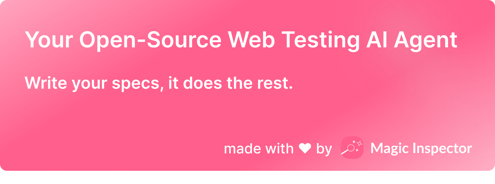
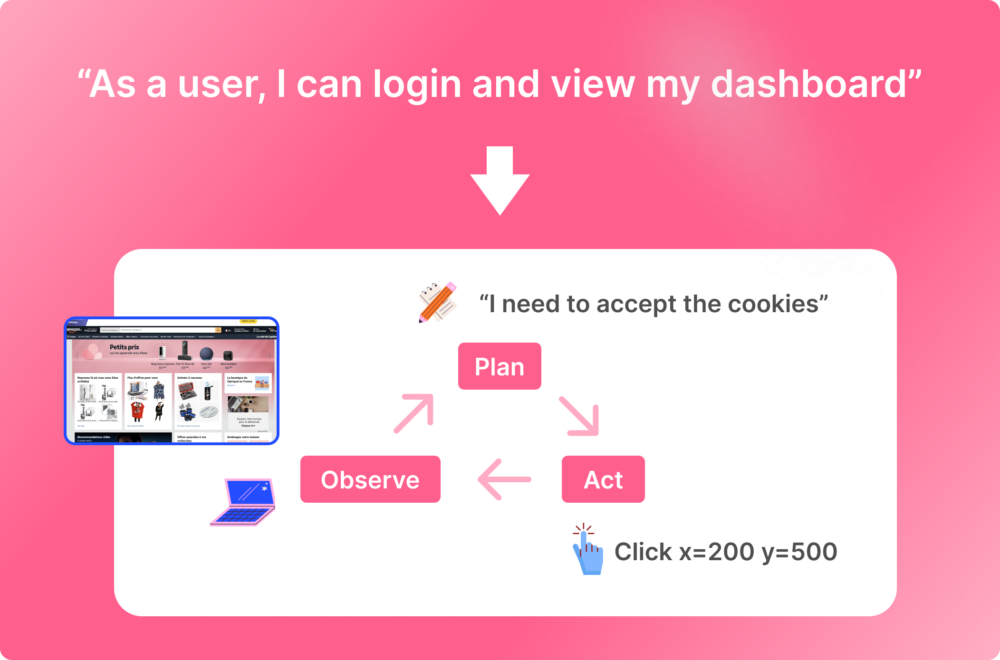

<p align="center">
  <a href="https://magicinspector.com"></a>
</p>

<p align="center">
    <em>.</em>
</p>

<p align=center>
Your Open-Source AI Web Testing Agent — Auto Inspector is an autonomous AI Agent that will test your website and give you a report of the results based on your user stories.
</p>

<p align="center">
Auto Inspector is made by the <a href="https://magicinspector.com">Magic Inspector</a> team to change the way web testing is done.
</p>

<p align=center>
Focus on planning your tests, we run them for you.
</p>

<p align="center">
<a href="" target="_blank">
    
</a>
<a href="" target="_blank">
    
</a>
</p>

<p align="center">
.
</p>

<h3 align="center">
🌟 Give us some love by starring this repository! 🌟  
</h3>

<p align="center">
.
</p>


# Open-Source Web Testing AI Agent

Auto Inspector is <b>fully open-sourced (Apache 2.0)</b> and <a href="https://magicinspector.com">Magic Inspector</a> offers cloud hosting and dedicated enterprise grade support.


## Demo 

User story: I can log in to my account with 'demo@magicinspector.com' and 'demopassword' and create a new test inside the Default Project. Once the test has been created, I can see the test editor.

https://github.com/user-attachments/assets/7873f6a8-89d5-4234-8a17-0d993f5dc5c7

## How it works

<p align="center">
  <a href="https://magicinspector.com"></a>
</p>

## Getting Started

ℹ️ Note: Auto Inspector is currently in development and not ready to self-host. If you're looking for an enterprise-grade testing solution, check our **[Cloud Version](https://magicinspector.com)**.

### Installation

ℹ️ Note: Auto Inspector requires Node.js version 20 or higher.


```bash
git clone https://github.com/magic-inspector/auto-inspector.git
cd auto-inspector/auto-inspector

npm install
```

### Add your OpenAI API key

```
echo OPENAI_API_KEY="<replace-with-your-key>" >> .env
```

### Run an example test case

```
npm run example
```

### Run your own test case

```
npm run scenario -- --url="start-url" --user-story="As a user, I can <replace-with-your-user-story>"
```

## Roadmap

We're committed to improving the project, feel free to open an issue if you have any suggestions or feedback.

| Component                | Status | Features                                                                                                                                    |
|:-------------------------|:------:|---------------------------------------------------------------------------------------------------------------------------------------------|
| Alpha release       |  ✅️️   | <ul><li>Release a first minimap version that is able to run a test</li></ul>                                                             |
| Provide a GUI |    🏗️   | <ul><li>Add docker configuration</li><li>Add a simple UI to create a test</li></ul> |
| Build a serious benchmark framework      |  🏗️  | <ul><li>The only serious way to improve the agent is to build a serious benchmark dedicated to the web testing.</li></ul>                              |
| Improve the Agent's ability to test |  🏗️   | <ul><li>The evaluatior agent is still not reliable enough to give a feedback to the main agent.</li><li>We also need to improve the performance of the agent.</li></ul>                                                         |


<p align="center">
.
</p>

<h3 align="center">
🌟 Give us some love by starring this repository! 🌟  
</h3>

<p align="center">
.
</p>


