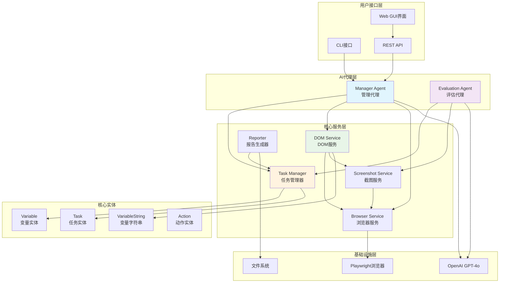
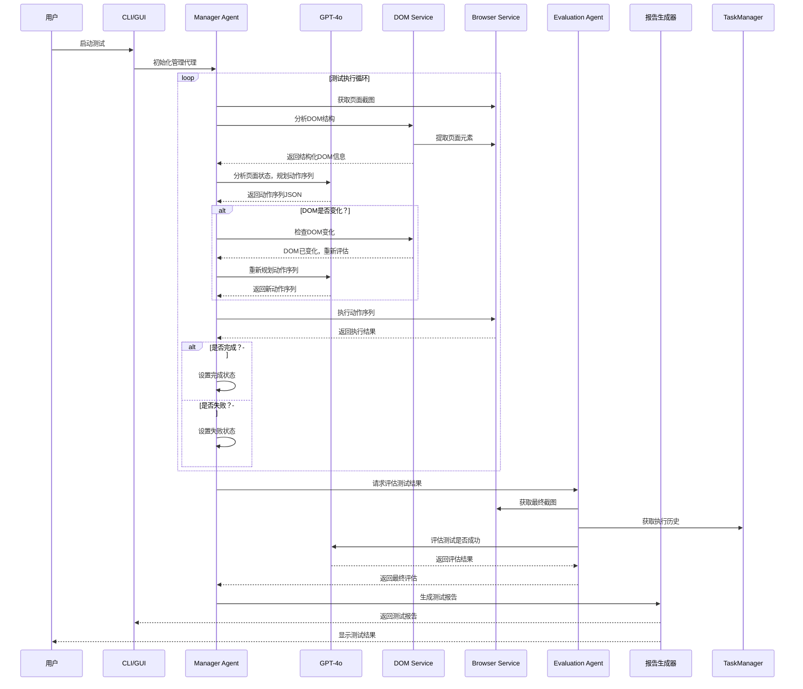
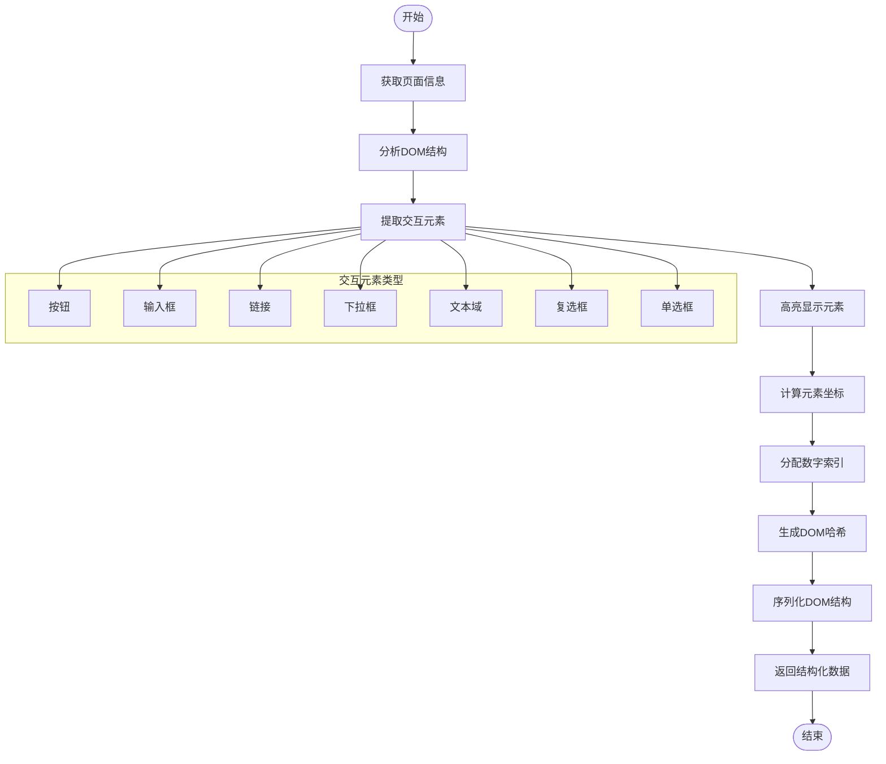
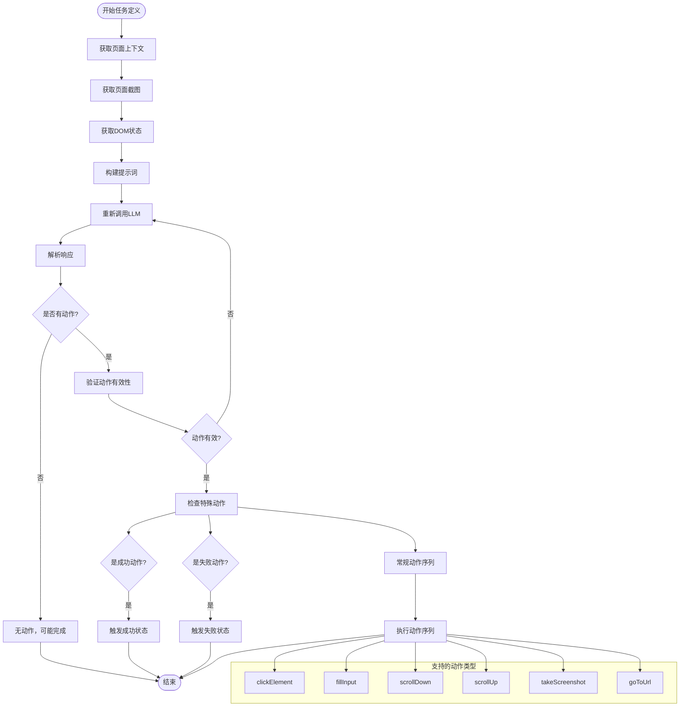
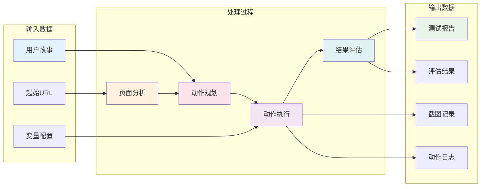

# AI Auto Inspector 架构与执行流程图

## 整体架构图



## 执行流程图



## DOM Service 工作流程图



## Manager Agent 决策流程图



## 数据流图



## 变量管理系统流程图

```mermaid
flowchart TD
    Start([开始变量处理]) --> LoadVars[加载变量配置]
    LoadVars --> ClassifyVars[分类变量类型]

    ClassifyVars --> IsSecret{是否为密钥?}
    IsSecret -->|是| SecretVar[密钥变量]
    IsSecret -->|否| NormalVar[普通变量]

    SecretVar --> NoDisplay[不在日志中显示]
    NormalVar --> CanDisplay[可在日志中显示]

    NoDisplay --> SafeReplace[安全替换模式]
    CanDisplay --> SafeReplace

    SafeReplace --> ProcessVarString[处理变量字符串]
    ProcessVarString --> FindPatterns[查找{{变量}}模式]
    FindPatterns --> ReplaceValues[替换实际值]
    ReplaceValues --> ValidateResult[验证替换结果]
    ValidateResult --> Success([替换成功])
    ValidateResult --> Failed([替换失败])

    subgraph "变量类型示例"
        Email["user_email (普通)"]
        Password["password (密钥)"]
        Token["api_token (密钥)"]
        Username["username (普通)"]
    end

    ClassifyVars --> Email
    ClassifyVars --> Password
    ClassifyVars --> Token
    ClassifyVars --> Username
```

这些图表展示了AI Auto Inspector的核心架构和执行流程，包括：

1. **整体架构图** - 展示系统各层组件之间的关系
2. **执行流程图** - 描述从初始化到结果输出的完整流程
3. **DOM Service工作流程** - 详细说明DOM分析和元素处理过程
4. **Manager Agent决策流程** - 展示AI代理的思考和决策过程
5. **数据流图** - 描述数据在系统中的流转过程
6. **变量管理系统流程** - 说明变量配置和安全处理机制

每个图表都采用了Mermaid格式，可以轻松集成到文档中或使用支持Mermaid的工具查看。